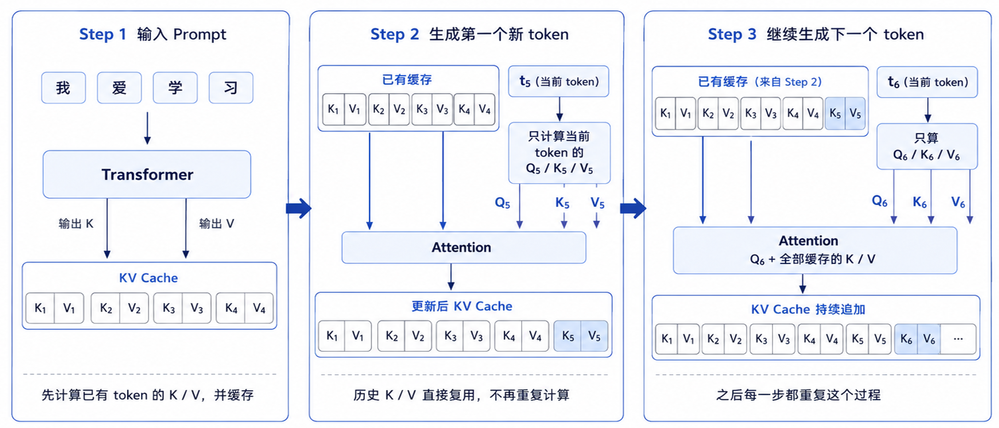
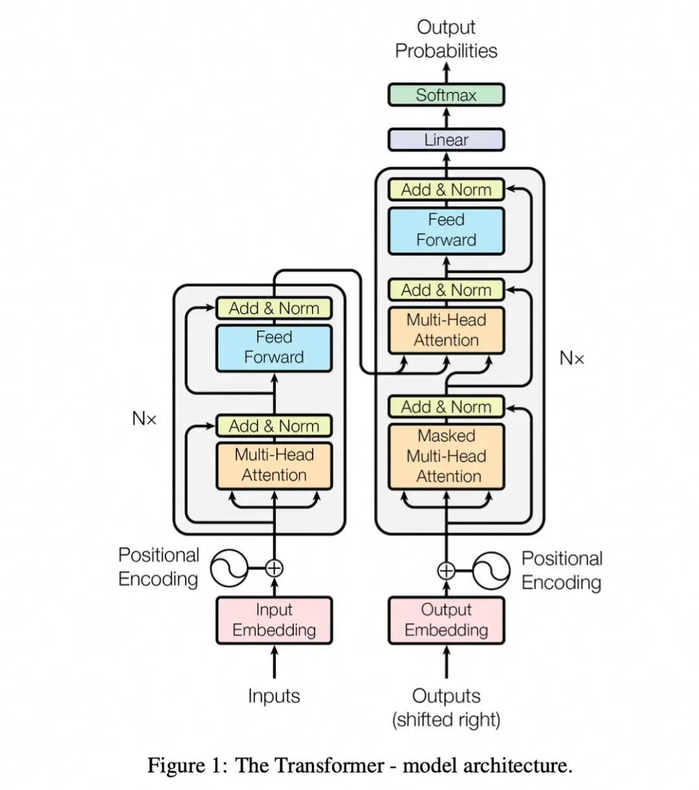
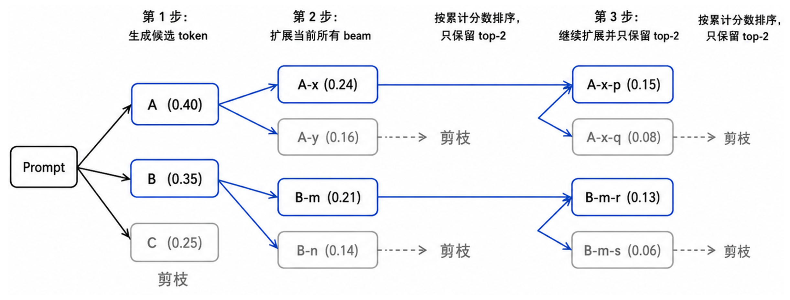
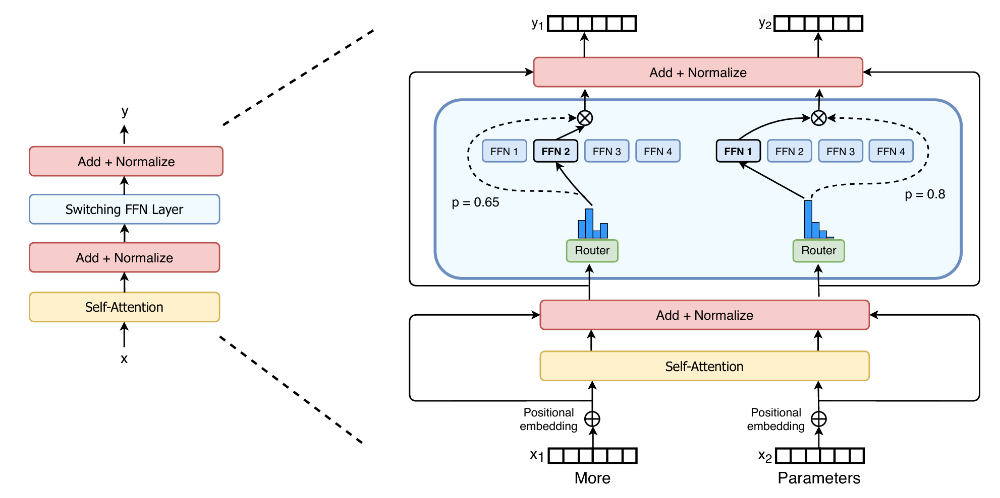

# 大模型模块 - pytorch 手撕

## 1. 按 QKV 来源划分的 Attention

### 1.1 Self-Attention

自注意力机制。

```python
import math
import torch
import torch.nn as nn
import torch.nn.functional as F

class SelfAttention(nn.Module):
    def __init__(self, d_model):
        super().__init__()
        self.d_model = d_model
        
        self.q_proj = nn.Linear(d_model, d_model, bias=False)
        self.k_proj = nn.Linear(d_model, d_model, bias=False)
        self.v_proj = nn.Linear(d_model, d_model, bias=False)
        self.o_proj = nn.Linear(d_model, d_model, bias=False)
        
    def forward(self, x, mask=None):
        """
        x: (batch, seq_len, d_model)
        mask: (seq_len, seq_len), True=屏蔽, broadcast到batch维度
        """
        # 计算QKV
        Q = self.q_proj(x)  # Q: (batch, seq_len, d_model)
        K = self.k_proj(x)  # K: (batch, seq_len, d_model)
        V = self.v_proj(x)  # V: (batch, seq_len, d_model)
        
        # 计算注意力得分并添加掩码，scores: (batch, seq_len, seq_len)
        scores = torch.matmul(Q, K.transpose(-2, -1)) / math.sqrt(self.d_model)
        if mask is not None:
            scores = scores.masked_fill(mask, float("-inf"))
        
        # 计算注意力权重和输出
        attn_weights = F.softmax(scores, dim=-1)  # attn_weights: (batch, seq_len, seq_len)
        out = torch.matmul(attn_weights, V)  # out: (batch, seq_len, d_model)
        return self.o_proj(out)  # return: (batch, seq_len, d_model)
```

外部调用 demo：

```python
import torch
batch = 2
seq_len = 4
d_model = 8

# 不传mask的版本
x = torch.randn(batch, seq_len, d_model)
attn = SelfAttention(d_model=d_model)
out = attn(x)

# 传mask的版本
x = torch.randn(batch, seq_len, d_model)
mask = torch.triu(torch.ones(seq_len, seq_len, dtype=torch.bool), diagonal=1)
out = attn(x, mask=mask)
```

**pytorch 相关基础**

- `super().__init__()` 调用所继承父类的初始化方法。
- 线性层 `self.W = nn.Linear(···)`  被 `self.W(x)` 调用时，实际会对 `x` 的最后一维执行 `x @ W^T + b`。
- `if mask is not None` 不能替换为 `if mask`，因为 `mask` 本身是布尔型张量，如果直接 `if mask`，pytorch 会直接报错：`Boolean value of Tensor with more than one value is ambiguous`。 
- `torch.triu()` 建立上三角矩阵，`diagonal=1` 保留主对角线上方（不含主对角线），`diagnal=0` 保留主对角线及其上方（包含主对角线），`digoanal=-1` 保留主对角线下方1条线及其上方。这里对于某个当前 token 不应该对自己加掩码，因此应设置 `mask=False`。

### 1.2 Cross-Attention

交叉注意力机制。

```python
import math
import torch
import torch.nn as nn
import torch.nn.functional as F

class CrossAttention(nn.Module):
    def __init__(self, d_model):
        super().__init__()
        self.d_model = d_model
        
        self.q_proj = nn.Linear(d_model, d_model, bias=False)
        self.k_proj = nn.Linear(d_model, d_model, bias=False)
        self.v_proj = nn.Linear(d_model, d_model, bias=False)
        self.o_proj = nn.Linear(d_model, d_model, bias=False)
        
    def forward(self, x_q, x_kv, mask=None):
        """
        x_q: (batch, seq_q, d_model)
        x_kv: (batch, seq_kv, d_model)
        mask: (seq_q, seq_kv), True=屏蔽, broadcast 到batch维度
        """
        # 计算QKV
        Q = self.q_proj(x_q)   # Q: (batch, seq_q, d_model)
        K = self.k_proj(x_kv)  # K: (batch, seq_kv, d_model)
        V = self.v_proj(x_kv)  # V: (batch, seq_kv, d_model)
        
        # 计算注意力得分并添加掩码，scores: (batch, seq_q, seq_kv)
        scores = torch.matmul(Q, K.transpose(-2, -1)) / math.sqrt(self.d_model)
        if mask is not None:
            scores = scores.masked_fill(mask, float("-inf"))
        
        # 计算注意力权重和输出
        attn_weights = F.softmax(scores, dim=-1)  # attn_weights: (batch, seq_q, seq_kv)
        out = torch.matmul(attn_weights, V)  # out: (batch, seq_q, d_model)
        
        return self.o_proj(out)  # return: (batch, seq_len, d_model)
```

外部调用，如果添加 `mask` 一般是 `padding mask`：

```python
batch = 2
seq_q = 3
seq_kv = 5
d_model = 8

x_q = torch.randn(batch, seq_q, d_model)
x_kv = torch.randn(batch, seq_kv, d_model)

cross_attn = CrossAttention(d_model)
out = cross_attn(x_q, x_kv)
```

## 2. 按 KV 结构划分的 Attention

### 2.1 Multi-Head Self-Attention (MHA)

多头自注意力机制。

```python
import math
import torch
import torch.nn as nn
import torch.nn.functional as F

class MultiHeadAttention(nn.Module):
    def __init__(self, d_model, num_heads):
        super().__init__()
        assert d_model % num_heads == 0
        
        self.d_model = d_model
        self.num_heads = num_heads
        self.head_dim = d_model // num_heads
        
        self.q_proj = nn.Linear(d_model, d_model, bias=False)
        self.k_proj = nn.Linear(d_model, d_model, bias=False)
        self.v_proj = nn.Linear(d_model, d_model, bias=False)
        self.o_proj = nn.Linear(d_model, d_model, bias=False)

    def forward(self, x, mask=None):
        """
        x: (batch, seq_len, d_model)
        mask: (seq_len, seq_len), True=屏蔽, broadcast到batch和num_heads维度
        """
        # 获取x的相关维度
        batch, seq_len, _ = x.shape
        
        # 计算QKV
        Q = self.q_proj(x)  # Q:(batch, seq_len, d_model)
        K = self.k_proj(x)  # K:(batch, seq_len, d_model)
        V = self.v_proj(x)  # V:(batch, seq_len, d_model)
        
        # QKV分头: (batch, num_heads, seq_len, head_dim)
        Q = Q.view(batch, seq_len, self.num_heads, self.head_dim).transpose(1, 2)
        K = K.view(batch, seq_len, self.num_heads, self.head_dim).transpose(1, 2)
        V = V.view(batch, seq_len, self.num_heads, self.head_dim).transpose(1, 2)
        
        # 计算注意力得分并添加掩码, scores:(batch, num_heads, seq_len, seq_len)
        scores = torch.matmul(Q, K.transpose(-2, -1)) / math.sqrt(self.head_dim)
        if mask is not None:
            if mask.dim() == 3:  # 支持传入(batch, seq_len, seq_len)的mask
                mask = mask.unsqueeze(1)  # mask: (batch, 1, seq_len, seq_len)
            scores = scores.masked_fill(mask, float('-inf'))
            
        # 计算注意力权重和输出
        attn_weights = F.softmax(scores, dim=-1)  # attn_weights: (batch, num_heads, seq_len, seq_len)
        out = torch.matmul(attn_weights, V)  # out: (batch, num_heads, seq_len, head_dim)
        
        # 合并多头结果
        out = out.transpose(1, 2)  # out: (batch, seq_len, num_heads, head_dim)
        out = out.contiguous().view(batch, seq_len, self.d_model)  # out: (batch, seq_len, d_model)
        
        return self.o_proj(out)  # return: (batch, seq_len, d_model)
```

外部调用：

```python
x = torch.randn(2, 4, 8)
mha = MultiHeadAttention(d_model=8, num_heads=2)
mask = torch.triu(torch.ones(4, 4, dtype=torch.bool), diagonal=1)
out = mha(x, mask=mask)
```

**pytorch 相关基础**：

- 如果 `assert` 希望给用户提示，可以写 `assert d_model % num_heads == 0, "d_model must be a multiples of num_heads"`。

- 如果传入的 `mask` 是 `(batch, seq_len, seq_len)` 的形状（通过 `if mask.dim() == 3` 来判断），需要先执行 `mask.unsqueeze(1)` 变为 `(batch, 1, seq_len, seq_len)`，否则广播机制对齐会出错。

### 2.2 MHA with KV Cache

带 KV Cache 的多头注意力机制。

使用 KV Cache 的自回归生成中，每步只计算当前 token 的 Q/K/V，历史 token 的 K/V 保存在缓存中复用，从而避免重复计算加速推理。



```python
import math
import torch
import torch.nn as nn
import torch.nn.functional as F

class MultiHeadAttention(nn.Module):
    def __init__(self, d_model,  num_heads):
        super().__init__()
        assert d_model % num_heads == 0
        self.d_model = d_model
        self.num_heads = num_heads
        self.head_dim = d_model // num_heads
        
        self.q_proj = nn.Linear(d_model, d_model, bias=False)
        self.k_proj = nn.Linear(d_model, d_model, bias=False)
        self.v_proj = nn.Linear(d_model, d_model, bias=False)
        self.o_proj = nn.Linear(d_model, d_model, bias=False)
        
    def forward(self, x, mask=None, past_kv=None):
        """
        x: (batch, seq_len, d_model)
        mask: (seq_len, past_len+seq_len), True=屏蔽, broadcast到batch和num_heads维度
        past_kv: tuple, (past_k, past_v)
        past_k/past_v: (batch, num_heads, past_len, head_dim)
        """
        # 获取x相关维度
        batch, seq_len, _ = x.shape
        
        # 计算QKV
        Q = self.q_proj(x)  # Q: (batch, seq_len, d_model)
        K = self.k_proj(x)  # K: (batch, seq_len, d_model)
        V = self.v_proj(x)  # V: (batch, seq_len, d_model)
        
        # QKV分头: (batch, num_heads, seq_len, head_dim)
        Q = Q.view(batch, seq_len, self.num_heads, self.head_dim).transpose(1, 2)
        K = K.view(batch, seq_len, self.num_heads, self.head_dim).transpose(1, 2)
        V = V.view(batch, seq_len, self.num_heads, self.head_dim).transpose(1, 2)
        
        # 使用KV Cache
        if past_kv is not None:
            past_k, past_v = past_kv
            # 新旧KV在seq_len维度拼接: (batch, num_heads, past_len+seq_len, head_dim)
            K = torch.cat([past_k, K], dim=-2)
            V = torch.cat([past_v, V], dim=-2)
        new_kv = (K, V)  # 更新KV Cache
        
        # 计算注意力得分并添加掩码, scores:(batch, num_heads, seq_len, past_len+seq_len)
        scores = torch.matmul(Q, K.transpose(-2, -1)) / math.sqrt(self.head_dim)
        if mask is not None:
            if mask.dim() == 3:  # 支持传入(batch, seq_len, past_len+seq_len)的mask
                mask = mask.unsqueeze(1)  # mask: (batch, 1, seq_len, past_len+seq_len)
            scores = scores.masked_fill(mask, float('-inf'))
        
        # 计算注意力权重和输出
        attn_weights = F.softmax(scores, dim=-1)  # attn_weights: (batch, num_heads, seq_len, past_len+seq_len)
        out = torch.matmul(attn_weights, V)  # out: (batch, num_heads, seq_len, head_dim)
        
        # 合并多头结果
        out = out.transpose(1, 2)  # out: (batch, seq_len, num_heads, head_dim)
        out = out.contiguous().view(batch, seq_len, self.d_model)  # out: (batch, seq_len, d_model)
        
        # return: (batch, seq_len, d_model), KV Cache
        return self.o_proj(out), new_kv
```

外部调用：

```python
batch = 2
d_model = 8
num_heads = 2
steps = 5

mha = MultiHeadAttention(d_model=d_model, num_heads=num_heads)
past_kv = None

for t in range(steps):
  # 自回归推理时，每一步只输入当前新 token
  x = torch.randn(batch, 1, d_model)
  out, past_kv = mha(x, past_kv=past_kv)

  print(f"step {t + 1}")
  print("out:", out.shape)
  print("cache_k:", past_kv[0].shape)
  print("cache_v:", past_kv[1].shape)
```

注意循环中不断传入 `past_kv`，结果输出大致如下：

```
step 1
out:     torch.Size([2, 1, 8])
cache_k: torch.Size([2, 2, 1, 4])
cache_v: torch.Size([2, 2, 1, 4])

step 2
out:     torch.Size([2, 1, 8])
cache_k: torch.Size([2, 2, 2, 4])
cache_v: torch.Size([2, 2, 2, 4])

step 3
out:     torch.Size([2, 1, 8])
cache_k: torch.Size([2, 2, 3, 4])
cache_v: torch.Size([2, 2, 3, 4])
```

从代码上，`past_kv` 保存了所有过去 token 的 KV。如果不使用 KV Cache，每次传入的 `x` 的 `seq_len` 会越来越长，因为每次 x 都得带上之前已经生成的 token 前缀，然后重新计算它们的 KV；使用 KV Cache 后，每次传入的 `x` 维度为 `(batch, 1, d_model)`。

### 2.3 Multi-Query Attention (MQA)

多查询注意力机制。Q 使用 `num_heads` 个头，KV 使用 1 个头。

```python
import math
import torch
import torch.nn as nn
import torch.nn.functional as F

class MultiQueryAttention(nn.Module):
    def __init__(self, d_model, num_heads):
        super().__init__()
        assert d_model % num_heads == 0
        self.d_model = d_model
        self.num_heads = num_heads
        self.head_dim = d_model // num_heads
        
        # KV只有一个头的参数量
        self.q_proj = nn.Linear(d_model, d_model, bias=False)
        self.k_proj = nn.Linear(d_model, self.head_dim, bias=False)
        self.v_proj = nn.Linear(d_model, self.head_dim, bias=False)
        self.o_proj = nn.Linear(d_model, d_model, bias=False)
        
    def forward(self, x, mask=None):
        """
        x: (batch, seq_len, d_model)
        mask: (seq_len, seq_len), True=屏蔽, broadcast到batch和num_heads维度
        """
        # 获取x相关维度
        batch, seq_len, _ = x.shape
        
        # 计算QKV
        Q = self.q_proj(x)  # Q: (batch, seq_len, d_model)
        K = self.k_proj(x)  # K: (batch, seq_len, head_dim)
        V = self.v_proj(x)  # V: (batch, seq_len, head_dim)
        
        # QKV分头, Q: (batch, num_heads, seq_len, head_dim)
        Q = Q.view(batch, seq_len, self.num_heads, self.head_dim).transpose(1, 2)
        K = K.unsqueeze(1)  # K: (batch, 1, seq_len, head_dim)
        V = V.unsqueeze(1)  # V: (batch, 1, seq_len, head_dim)
        
        # 自动广播K计算注意力得分并添加掩码, scores:(batch, num_heads, seq_len, seq_len)
        scores = torch.matmul(Q, K.transpose(-2, -1)) / math.sqrt(self.head_dim)
        if mask is not None:
            if mask.dim() == 3:
                mask = mask.unsqueeze(1)  # 支持传入(batch, seq_len, seq_len)的mask
            scores = scores.masked_fill(mask, float("-inf"))  # mask: (batch, 1, seq_len, seq_len)
        
        # 计算注意力权重和输出
        attn_weights = F.softmax(scores, dim=-1)  # attn_weights: (batch, num_heads, seq_len, seq_len)
        out = torch.matmul(attn_weights, V)  # out: (batch, num_heads, seq_len, head_dim)
        
        # 合并多头结果
        out = out.transpose(1, 2)  # out: (batch, seq_len, num_heads, head_dim)
        out = out.contiguous().view(batch, seq_len, self.d_model)  # out: (batch, seq_len, d_model)
        
        return  self.o_proj(out)  # return: (batch, seq_len, d_model)
```

外部调用：

```python
batch = 2
seq_len = 4
d_model = 8
num_heads = 2

x = torch.randn(batch, seq_len, d_model)
mqa = MultiQueryAttention(d_model=d_model, num_heads=num_heads)
mask = torch.triu(torch.ones(seq_len, seq_len, dtype=torch.bool), diagonal=1)
out = mqa(x, mask=mask)
```

### 2.4 Grouped-Query Attention (GQA)

分组查询注意力机制。

```python
import math
import torch
import torch.nn as nn
import torch.nn.functional as F

class GroupedQueryAttention(nn.Module):
    def __init__(self, d_model, num_q_heads, num_kv_heads):
        super().__init__()
        assert d_model % num_q_heads == 0
        assert num_q_heads % num_kv_heads == 0
        self.d_model = d_model
        self.num_q_heads = num_q_heads
        self.num_kv_heads = num_kv_heads
        self.head_dim = d_model // num_q_heads
        self.num_groups = num_q_heads // num_kv_heads
        
        self.q_proj = nn.Linear(d_model, d_model, bias=False)
        # kv的线性层映射到 head_dim * num_kv_heads 维
        self.k_proj = nn.Linear(d_model, self.head_dim * self.num_kv_heads, bias=False)
        self.v_proj = nn.Linear(d_model, self.head_dim * self.num_kv_heads, bias=False)
        self.o_proj = nn.Linear(d_model, d_model, bias=False)
        
    def forward(self, x, mask=None):
        """
        x: (batch, seq_len, d_model)
        mask: (seq_len, seq_len), True=屏蔽, broadcast到batch和num_q_heads维度
        """
        # 获取x相关维度
        batch, seq_len, _ = x.shape
        
        # 计算QKV
        Q = self.q_proj(x)  # Q: (batch, seq_len, d_model)
        K = self.k_proj(x)  # K: (batch, seq_len, head_dim*num_kv_heads)
        V = self.v_proj(x)  # V: (batch, seq_len, head_dim*num_kv_heads)
        
        # Q分头, Q: (batch, num_q_heads, seq_len, head_dim)
        Q = Q.view(batch, seq_len, self.num_q_heads, self.head_dim).transpose(1, 2)
        # KV分头，KV: (batch, num_kv_heads, seq_len, head_dim)
        K = K.view(batch, seq_len, self.num_kv_heads, self.head_dim).transpose(1, 2)
        V = V.view(batch, seq_len, self.num_kv_heads, self.head_dim).transpose(1, 2)
        
        # 扩展KV: (batch, num_q_heads, seq_len, head_dim)
        K = K.repeat_interleave(self.num_groups, dim=1)
        V = V.repeat_interleave(self.num_groups, dim=1)
        
        # 计算注意力得分并添加掩码, scores: (batch, num_q_heads, seq_len, seq_len)
        scores = torch.matmul(Q, K.transpose(-2, -1)) / math.sqrt(self.head_dim)
        if mask is not None:
            if mask.dim() == 3:  # 支持传入(batch, seq_len, seq_len)的mask
                mask = mask.unsqueeze(1)  # mask: (batch, 1, seq_len, seq_len)
            scores = scores.masked_fill(mask, float('-inf'))
        
        # 计算注意力权重和输出
        attn_weights = F.softmax(scores, dim=-1)  # attn_weights: (batch, num_q_heads, seq_len, seq_len)
        out = torch.matmul(attn_weights, V)  # out: (batch, num_q_heads, seq_len, head_dim)
        
        # 合并多头结果
        out = out.transpose(1, 2)
        out = out.contiguous().view(batch, seq_len, self.d_model)
        
        return self.o_proj(out)  # return: (batch, seq_len, d_model)
```

外部调用：

```python
batch = 2
seq_len = 4
d_model = 8
num_q_heads = 4
num_kv_heads = 2
x = torch.randn(batch, seq_len, d_model)

gqa = GroupedQueryAttention(
  d_model=d_model,
  num_q_heads=num_q_heads,
  num_kv_heads=num_kv_heads
)

mask = torch.triu(
  torch.ones(seq_len, seq_len, dtype=torch.bool),
  diagonal=1,
)

out = gqa(x, mask=mask)
```

**pytorch 相关基础**

- `K` 和 `V` 的 head 维度不是1，因此不能自动广播到 `Q` 的 head 维度。

### 2.5 Multi-head Latent Attention (MLA)

多头潜变量注意力机制，配合 KV Cache 使用，将 KV 压缩为潜变量存储，需要计算时再恢复原 KV 表示，从而降低显存占用。

```python
import math
import torch
import torch.nn as nn
import torch.nn.functional as F

class MultiHeadLatentAttention(nn.Module):
    def __init__(self, d_model, num_heads, latent_dim):
        super().__init__()
        assert d_model % num_heads == 0
        self.d_model = d_model
        self.num_heads = num_heads
        self.head_dim = d_model // num_heads
        
        self.q_proj = nn.Linear(d_model, d_model, bias=False)
        self.kv_down_proj = nn.Linear(d_model, latent_dim, bias=False)
        self.k_up_proj = nn.Linear(latent_dim, d_model, bias=False)
        self.v_up_proj = nn.Linear(latent_dim, d_model, bias=False)
        self.o_proj = nn.Linear(d_model, d_model, bias=False)
        
    def forward(self, x, mask=None, past_latent_kv=None):
        """
        x: (batch, seq_len, d_model)
        mask: (seq_len, past_len + seq_len)
        past_latent_kv: None或(batch, past_len+seq_len, latent_dim)
        """
        # 获取x相关维度
        batch, seq_len, _ = x.shape
        
        # 计算QKV
        Q = self.q_proj(x)  # Q: (batch, seq_len, d_model)
        latent_kv = self.kv_down_proj(x)  # K: (batch, seq_len, latent_dim)
        
        # 使用KV Cache
        past_len = past_latent_kv.size(-2) if past_latent_kv is not None else 0
        if past_latent_kv is not None:
            # 新旧latent_kv在seq_len维度拼接: (batch, past_len+seq_len, latent_dim)
            latent_kv = torch.cat([past_latent_kv, latent_kv], dim=-2)
        new_latent_kv = latent_kv
        
        # 潜变量还原
        K = self.k_up_proj(latent_kv)  # K: (batch, past_len+seq_len, d_model)
        V = self.v_up_proj(latent_kv)  # V: (batch, past_len+seq_len, d_model)
        
        # QKV分头, Q: (batch, num_heads, seq_len, head_dim)
        Q = Q.view(batch, seq_len, self.num_heads, self.head_dim).transpose(1, 2)
        # KV: (batch, num_heads, past_len + seq_len, head_dim)
        K = K.view(batch, past_len + seq_len, self.num_heads, self.head_dim).transpose(1, 2)
        V = V.view(batch, past_len + seq_len, self.num_heads, self.head_dim).transpose(1, 2)
        
        # 计算注意力得分并添加掩码, scores: (batch, num_heads, seq_len, past_len + seq_len)
        scores = torch.matmul(Q, K.transpose(-2, -1)) / math.sqrt(self.head_dim)
        if mask is not None:
            if mask.dim() == 3:  # 支持传入(batch, seq_len, seq_len)的mask
                mask = mask.unsqueeze(1)
            scores = scores.masked_fill(mask, float('-inf'))
        
        # 计算注意力权重和输出
        attn_weights = F.softmax(scores, dim=-1)  # attn_weights: (batch, num_heads, seq_len, past_len + seq_len)
        out = torch.matmul(attn_weights, V)  # out: (batch, num_heads, seq_len, head_dim)
        
        # 合并多头结果
        out = out.transpose(1, 2)  # out: (batch, seq_len, num_heads, head_dim)
        out = out.contiguous().view(batch, seq_len, self.d_model)
        
        # return: (batch, seq_len, d_model), (batch, past_len + seq_len, latent_dim)
        return self.o_proj(out), new_latent_kv
```


## 3. Transformer

### 3.1 LayerNorm

层归一化。

```python
import torch
import torch.nn as nn

class LayerNorm(nn.Module):
    def __init__(self, d_model, eps=1e-5):
        super().__init__()
        self.eps = eps
        # 初始化gamma=1,beta=0
        self.gamma = nn.Parameter(torch.ones(d_model))
        self.beta = nn.Parameter(torch.zeros(d_model))
        
    def forward(self, x):
        """
        x: (batch, seq_len, d_model)
        """
        # 计算均值和方差
        mean = x.mean(dim=-1, keepdim=True)
        var = x.var(dim=-1, keepdim=True, unbiased=False)
        
        #归一化并缩放平移
        x = (x - mean) / torch.sqrt(var + self.eps)
        x = self.gamma * x + self.beta
        return x
```

**pytorch 相关基础**

- 对张量某一维特征计算统计量聚合时，`keepdim=True` 保证聚合后该维度为1，并不会消失而减少维度。

### 3.2 RMSNorm

Root Mean Square Layer Normalization，均方根归一化。

```python
import torch
import torch.nn as nn

class RMSNorm(nn.Module):
    def __init__(self, d_model, eps=1e-5):
        super().__init__()
        self.eps = eps
        self.gamma = nn.Parameter(torch.ones(d_model))
        
    def forward(self, x):
        """
        x: (batch, seq_len, d_model)
        """
        # 计算均方根
        rms = torch.sqrt(torch.mean(x ** 2, dim=-1, keepdim=True) + self.eps)
        
        # 归一化并缩放
        x = x / rms
        x = self.gamma * x
        return x
```

### 3.3 RoPE

旋转位置编码。

对第 $m$ 个位置、某一对维度 $(2i,\,2i+1)$，RoPE 做二维旋转：
$$
\begin{pmatrix}
x'_{2i}\\
x'_{2i+1}
\end{pmatrix}
=
\begin{pmatrix}
\cos(m\theta_i) & -\sin(m\theta_i)\\
\sin(m\theta_i) & \cos(m\theta_i)
\end{pmatrix}
\begin{pmatrix}
x_{2i}\\
x_{2i+1}
\end{pmatrix}
$$
其中
$$
\theta_i = 10000^{-2i/d}
$$
展开就是：
$$
x'_{2i}=x_{2i}\cos(m\theta_i)-x_{2i+1}\sin(m\theta_i)\\
x'_{2i+1}=x_{2i}\sin(m\theta_i)+x_{2i+1}\cos(m\theta_i)
$$
对 $Q,K$ 都这样旋转。其关键性质是：
$$
\langle R_m q,\; R_n k\rangle
=
\langle q,\; R_{n-m} k\rangle
$$
所以注意力里自然编码了相对位置 $n-m$。

```python
import torch
import torch.nn as nn

class RoPE(nn.Module):
    def __init__(self, d_model, base=10000):
        super().__init__()
        assert d_model % 2 == 0
        
        self.d_model = d_model
        self.base = base
    
    def forward(self, x):
        """
        (x: batch, seq_len, d_model)
        """
        # 获取x相关信息
        seq_len = x.shape[-2]
        device = x.device
        
        # 生成频率, freq: (d_model / 2,)
        dim = torch.arange(0, self.d_model, 2, device=device)  # dim: (d_model / 2,)
        freq = self.base ** (-dim / self.d_model)
        
        # 生成旋转角, theta: (seq_len, d_model / 2)
        pos = torch.arange(seq_len, device=device)  # pos: (seq_len,)
        theta = torch.outer(pos, freq)
        
        # 计算正弦余弦值, cos/sin: (seq_len, d_model / 2)
        cos = torch.cos(theta)
        sin = torch.sin(theta)
        
        # x拆分为奇偶维, x_odd/x_even: (batch, seq_len, d_model / 2)
        x_even = x[..., 0::2]
        x_odd = x[..., 1::2]
        
        # 计算奇偶维RoPE, out_odd, out_even: (batch, seq_len, d_model / 2)
        out_even = cos * x_even - sin * x_odd
        out_odd = sin * x_even + cos * x_odd
        
        # 合并奇偶维, out: (batch, seq_len, d_model)
        out = torch.zeros_like(x)
        out[..., 0::2] = out_even
        out[..., 1::2] = out_odd
        return out
```

- 使用 `torch.arange, torch.randn, torch.ones, torch.zeros` 等创建新张量（例如本题中的 `dim` 和 `pos`）时，如果不指定 `device` 默认创建在 cpu，而一般传入的张量 `x` 会在 gpu 上，如果不指定 `device=device`，把新张量放在跟 `x` 同样的设备上，就会报错：`Expected all tensors to be on the same device`。如果使用 `torch.zeros_like(x)`，则会直接继承 `x` 的 `shape, device, dtype, layout`。
-  `...` 可以省略部分维度，可以出现在开头、中间、结尾，但一个索引表达式里只能有一个。

自注意力机制调用 RoPE：

```python
import math
import torch
import torch.nn as nn
import torch.nn.functional as F

class RoPE(nn.Module):
    """
    使用上面定义好的RoPE类，此处省略
    """

class SelfAttention(nn.Module):
    def __init__(self, d_model):
        super().__init__()
        assert d_model % 2 == 0

        self.d_model = d_model

        self.q_proj = nn.Linear(d_model, d_model, bias=False)
        self.k_proj = nn.Linear(d_model, d_model, bias=False)
        self.v_proj = nn.Linear(d_model, d_model, bias=False)
        self.o_proj = nn.Linear(d_model, d_model, bias=False)

        self.rope = RoPE(d_model)

    def forward(self, x, mask=None):
        """
        x: (batch, seq_len, d_model)
        mask: (seq_len, seq_len), True=屏蔽, broadcast到batch维度
        """
        Q = self.q_proj(x)
        K = self.k_proj(x)
        V = self.v_proj(x)

        # RoPE 只作用在 Q 和 K 上
        Q = self.rope(Q)
        K = self.rope(K)

        scores = torch.matmul(Q, K.transpose(-2, -1)) / math.sqrt(self.d_model)
        if mask is not None:
            scores = scores.masked_fill(mask, float("-inf"))

        attn_weights = F.softmax(scores, dim=-1)
        out = torch.matmul(attn_weights, V)

        return self.o_proj(out)
```

### 3.4 SwiGLU

$$
\text{SwiGLU}(x)=\text{SiLU}(xW_1)\odot(xW_3)
$$

再接一个输出投影形成 FFN：
$$
\text{FFN}(x)=\left[\text{SiLU}(xW_1)\odot(xW_3)\right]W_2
$$
其中：

- $xW_1$：门控分支
- $xW_2$：值分支
- $\odot$：逐元素乘法
- $\text{SiLU}(z)=z\sigma(z)$

```python
import torch
import torch.nn as nn
import torch.nn.functional as F

class SwiGLU(nn.Module):
    def __init__(self, d_model, d_ff):
        super().__init__()
        self.W1 = nn.Linear(d_model, d_ff, bias=False)  # gate_proj
        self.W3 = nn.Linear(d_model, d_ff, bias=False)  # up_proj
        self.W2 = nn.Linear(d_ff, d_model, bias=False)  # down_proj
        
    def forward(self, x):
        """
        x: (batch, seq_len, d_model)
        """
        # 计算gate分支和up分支
        gate = F.silu(self.W1(x))  # gate: (batch, seq_len, d_ff)
        value = self.W3(x)  # value: (batch, seq_len, d_ff)
        
        out = gate * value  # 逐元素相乘
        out = self.W2(out)
        return out
```

### 3.5 Transformer

定义 Transformer 单个模块以及整个 Decoder-only Transformer 架构。Transformer 原文架构如下。



```python
import torch
import torch.nn as nn
# 自定义模块部分
from attention import MultiHeadAttention
from norm import RMSNorm
from ffn import SwiGLU

class TransformerBlock(nn.Module):
    def __init__(self, d_model, num_heads, d_ff):
        super().__init__()
        
        self.attn = MultiHeadAttention(d_model, num_heads)
        self.ffn = SwiGLU(d_model, d_ff)
        
        self.norm1 = RMSNorm(d_model)
        self.norm2 = RMSNorm(d_model)
        
    def forward(self, x, mask=None):
        """
        x: (batch, seq_len, d_model)
        mask: (seq_len, seq_len), causal mask / padding mask
        """
        # Pre-LN + MHA + Residual Connection
        x = x + self.attn(self.norm1(x), mask=mask)
        # Pre-LN + FFN + Residual Connection
        x = x + self.ffn(self.norm2(x))
        return x
    
class DecoderOnlyTransformer(nn.Module):
    def __init__(self, vocab_size, d_model, num_heads, d_ff, num_layers, max_seq_len):
        super().__init__()
        
        self.token_emb = nn.Embedding(vocab_size, d_model)  # 词嵌入
        self.pos_emb = nn.Embedding(max_seq_len, d_model)  # 可学习的位置编码
        
        self.layers = nn.ModuleList(
            [TransformerBlock(d_model, num_heads, d_ff) for _ in range(num_layers)]
        )  # 注意力层
        
        self.norm = RMSNorm(d_model)  # 归一化层
        self.lm_head = nn.Linear(d_model, vocab_size, bias=False)  # 输出头
        
    def forward(self, input_ids, mask=None):
        """
        input_ids: (batch, seq_len)
        mask: (seq_len, seq_len)
        """
        # 获取input_ids相关信息
        seq_len = input_ids.shape[-1]
        device = input_ids.device
        
        # 词嵌入并添加可学习位置编码
        pos = torch.arange(seq_len, device=device)  # pos: (seq_len,)
        pos = pos.unsqueeze(0)  # pos: (1, seq_len), broadcast到batch维度
        x = self.token_emb(input_ids) + self.pos_emb(pos)  # x: (batch, seq_len, d_model)
        
        # 注意力层处理，处理过程中始终保持x: (batch, seq_len, d_model)
        for layer in self.layers:
            x = layer(x, mask=mask)
        
        x = self.norm(x)  # 归一化层
        logits = self.lm_head(x)  # 输出头, logits: (batch, seq_len, vocab_size)
        
        return logits
```

定义 `top-k` 采样方法（在后续解码策略部分会再次提到该方法），之后进行外部调用：

```python
import torch
import torch.nn.functional as F

def top_k_sampling(logits, k=50, temperature=1.0):
    """
    logits: (batch, vocab_size)
    return: (batch, 1)
    """
    if temperature <= 0:  # temperature=0即贪心搜索
        return torch.argmax(logits, dim=-1, keepdim=True)
    
    # 温度+top-k采样, topk_logits/idx: (batch, k)
    logits = logits / temperature
    topk_logits, topk_idx = torch.topk(logits, k, dim=-1)
    
    # 只对top-k进行softmax归一化，并取下标映射回原始id
    probs = F.softmax(topk_logits, dim=-1)  # probs: (batch, k)
    sampled_idx = torch.multinomial(probs, num_samples=1)  # sampled_idx: (batch, 1)
    next_token = torch.gather(topk_idx, dim=-1, index=sampled_idx)  # next_token: (batch, 1)
    return next_token
```

外部调用：

```python
batch = 2
seq_len = 8
vocab_size = 10000
d_model = 512
num_heads = 8
d_ff = 2048
num_layers = 6
max_seq_len = 1024

model = DecoderOnlyTransformer(
  vocab_size=vocab_size,
  d_model=d_model,
  num_heads=num_heads,
  d_ff=d_ff,
  num_layers=num_layers,
  max_seq_len=max_seq_len
)

input_ids = torch.randint(0, vocab_size, (batch, seq_len))

mask = torch.triu(
  torch.ones(seq_len, seq_len, dtype=torch.bool),
  diagonal=1
)

logits = model(input_ids, mask=mask)  # logits: (batch, seq_len, vocab_size)

next_token_id = top_k_sampling(logits, k=50, temperature=0.8)  # next_token_id: (batch,)
```

**pytorch 相关基础**:

- `nn.Embedding(num_embeddings, embedding_dim)`，其中 `num_embeddings` 表示嵌入 token 的数量，`embedding_dim` 表示每个 token 映射到多少维度的向量。传入 Embedding 的张量可以是任意维度，但必须保证张量内每一个数值必须在 0 到 `num_embeddings-1`。

- `torch.Tensor.max(dim)` 返回一个元组：`(values, indices)`，里面保存了每个仅 `dim` 不同的每一组的最大值及其下标。如果存在多个最大值，返回的下标是第一次出现最大值的位置。

- 一般 `F.softmax` 本身内部已经做了数值稳定处理，但如果要显式地展示“防止溢出”技巧，可以手动先减最大值：

```python
def softmax(x, dim=-1):
    x = x - x.max(dim=dim, keepdim=True).values
    exp_x = torch.exp(x)
    return exp_x / exp_x.sum(dim=dim, keepdim=True)
```

- `torch.multinomial()` 会在传入的参数中按数值比例采样，返回下标。要求输入只能是 1D 或 2D 的非负张量，`multinomial()` 会自动按权重比例采样（不一定求和要为1）。对于二维输入，默认对行采样，采样数量由 `num_samples` 决定。

-  `torch.gather(input, dim, index)` 表示沿着 `dim` 维度，根据 `index` 里的下标，从 input 里取元素。注意 `input` 和 `index` 的维度数必须一样，输出 shape 和 `index.shape` 一样。

### 3.6 Transformer with KV Cache

带 KV Cache 的 Transformer，需要使用 2.2 小节中的 `MultiHeadAttention`：

```python
import torch
import torch.nn as nn
# 自定义模块部分
from attention import MultiHeadAttention
from norm import RMSNorm
from ffn import SwiGLU

class TransformerBlock(nn.Module):
    def __init__(self, d_model, num_heads, d_ff):
        super().__init__()
        
        self.attn = MultiHeadAttention(d_model, num_heads)
        self.ffn = SwiGLU(d_model, d_ff)
        
        self.norm1 = RMSNorm(d_model)
        self.norm2 = RMSNorm(d_model)
        
    def forward(self, x, mask=None, past_kv=None):
        """
        x: (batch, seq_len, d_model)
        mask: (seq_len, seq_len), causal mask / padding mask
        """
        # Pre-LN + MHA + Residual Connection
        attn_out, new_kv = self.attn(self.norm1(x), mask=mask, past_kv=past_kv)
        x = x + attn_out
        # Pre-LN + FFN + Residual Connection
        x = x + self.ffn(self.norm2(x))
        return x, new_kv
    
class DecoderOnlyTransformer(nn.Module):
    def __init__(self, vocab_size, d_model, num_heads, d_ff, num_layers, max_seq_len):
        super().__init__()
        
        self.token_emb = nn.Embedding(vocab_size, d_model)  # 词嵌入
        self.pos_emb = nn.Embedding(max_seq_len, d_model)  # 可学习的位置编码
        
        self.layers = nn.ModuleList(
            [TransformerBlock(d_model, num_heads, d_ff) for _ in range(num_layers)]
        )  # 注意力层
        
        self.norm = RMSNorm(d_model)  # 归一化层
        self.lm_head = nn.Linear(d_model, vocab_size, bias=False)  # 输出头
        
    def forward(self, input_ids, mask=None, past_kv=None):
        """
        input_ids: (batch, seq_len)，带KV Cache的情形下一般seq_len=1
        mask: (seq_len, seq_len)
        past_kv: None或list, 长度为num_layers
        past_kv[i]: 第i层的(past_k, past_v)
        past_k/past_v: (batch, num_heads, past_len, head_dim)
        """
        # 获取input_ids相关信息
        seq_len = input_ids.shape[-1]
        device = input_ids.device
        past_len = past_kv[0][0].size(-2) if past_kv is not None else 0
        
        # 词嵌入并添加可学习位置编码，注意位置编码应是第past_len到past_len+seq_len之间的位置
        pos = torch.arange(past_len, past_len + seq_len, device=device)  # pos: (seq_len,)
        pos = pos.unsqueeze(0)  # pos: (1, seq_len), broadcast到batch维度
        x = self.token_emb(input_ids) + self.pos_emb(pos)  # x: (batch, seq_len, d_model)
        
        # 注意力层处理，处理过程中始终保持x: (batch, seq_len, d_model)
        new_past_kv = []
        for i, layer in enumerate(self.layers):
            layer_past_kv = None if past_kv is None else past_kv[i]
            x, layer_new_kv = layer(x, mask=mask, past_kv=layer_past_kv)
            new_past_kv.append(layer_new_kv)
        
        x = self.norm(x)  # 归一化层
        logits = self.lm_head(x)  # 输出头, logits: (batch, seq_len, vocab_size)
        
        return logits, new_past_kv
```

外部调用：

```python
batch = 2
vocab_size = 10000
d_model = 512
num_heads = 8
d_ff = 2048
num_layers = 6
max_seq_len = 1024

model = DecoderOnlyTransformer(
  vocab_size=vocab_size,
  d_model=d_model,
  num_heads=num_heads,
  d_ff=d_ff,
  num_layers=num_layers,
  max_seq_len=max_seq_len
)

past_kv = None

# 假设逐 token 生成 5 步
for step in range(5):
  input_ids = torch.randint(0, vocab_size, (batch, 1))
  # input_ids: (batch, 1)

  logits, past_kv = model(
      input_ids,
      mask=None,
      past_kv=past_kv
  )
```

## 4. 损失函数

### 4.1 SFT (Cross Entropy)

有监督微调 SFT 损失是 next-token prediction 的交叉熵损失：
$$
\mathcal{L}_{\text{SFT}}
=
-\frac{1}{N}
\sum_{t \in \text{response tokens}}
\log p_\theta(y_t \mid x, y_{<t})
$$
其中：

- $x$：prompt
- $y_t$：第 $t$ 个目标 token
- $y_{<t}$：前面已经生成的目标 token

直接使用 torch 中的 `cross_entropy`：

```python
import torch.nn.functional as F

# logits: (batch, seq_len, vocab_size)
# labels: (batch, seq_len)

# shift_logits: (batch, seq_len-1, vocab_size)，去掉最后一个token（结束符后面没有token了）
shift_logits = logits[:, :-1, :].contiguous() 
# shift_labels: (batch, seq_len-1)，去掉第一个token（起始不需要预测）
shift_labels = labels[:, 1:].contiguous()

loss = F.cross_entropy(shift_logits.view(-1, vocab_size), shift_labels.view(-1), ignore_index=-100)
```

自己实现 `cross_entropy`（一般不强制要求 `ignore_index` 参数）：

```python
import torch

def cross_entropy(logits, labels):
    """
    logits: (batch * (seq_len-1), vocab_size)
    labels: (batch * (seq_len-1),)
    """
    # 防止softmax溢出, logits: (batch * (seq_len-1), vocab_size)
    logits = logits - torch.max(logits, dim=-1, keepdim=True).values
    # log_softmax: (batch * (seq_len-1), vocab_size)
    exp_logits = torch.exp(logits)
    probs = exp_logits / exp_logits.sum(dim=-1, keepdim=True)
    log_probs = torch.log(probs)
    # 取对应标签id对应位置的负对数
    n = labels.size(0)
    loss = -log_probs[torch.arange(n, device=labels.device), labels]
    return loss.mean()

# logits: (batch, seq_len, vocab_size)
# labels: (batch, seq_len)

# shift_logits: (batch, seq_len-1, vocab_size)，去掉最后一个token（结束符后面没有token了）
shift_logits = logits[:, :-1, :].contiguous() 
# shift_labels: (batch, seq_len-1)，去掉第一个token（起始不需要预测）
shift_labels = labels[:, 1:].contiguous()

loss = cross_entropy(shift_logits.view(-1, vocab_size), shift_labels.view(-1))
```

**pytorch 基础**：

- `torch.nn.functional.cross_entropy()` 中 `ignore_index=-100` 表示 `label = -100` 的 token 不需要计算 loss，例如 padding 的地方或者 prompt 就可以设置其 `label = -100`。

### 4.2 DPO

Direct Preference Optimization，直接偏好优化。

**（1）DPO 数据格式**
$$
(x,\ y_w,\ y_l)
$$

- $x$：prompt
- $y_w$：chosen，偏好答案
- $y_l$：rejected，不偏好答案

**（2）DPO 损失函数（单样本）**
$$
\mathcal{L}_{\text{DPO}}
=
-\log \sigma
\left(
\beta
\left[
\log \frac{\pi_\theta(y_w|x)}{\pi_{\text{ref}}(y_w|x)}
-
\log \frac{\pi_\theta(y_l|x)}{\pi_{\text{ref}}(y_l|x)}
\right]
\right)
$$
其中：

- $\pi_\theta$：当前训练模型
- $\pi_{\text{ref}}$：冻结的参考模型，通常是 SFT 模型
- $\beta$：控制偏好优化强度
- $\sigma$：sigmoid

（3）从隐式 reward 看损失函数

先定义：
$$
r_\theta(x,y)
=
\beta
\left[
\log \pi_\theta(y|x)
-
\log \pi_{\text{ref}}(y|x)
\right]
$$
它可以看成 DPO 的隐式 reward。那么损失就是：
$$
\mathcal{L}_{\text{DPO}}
=
-\log \sigma
\left(
r_\theta(x,y_w)-r_\theta(x,y_l)
\right)
$$
即 `chosen 相对于参考模型被提高的水平 - rejected 相对于参考模型被提高的水平`。因此目标就是提高：
$$
r_\theta(x,y_w) > r_\theta(x,y_l)
$$
的概率，即让 chosen 的相对偏好分数高于 rejected。

```python
import torch.nn.functional as F

def dpo_loss(
    policy_chosen_logps,
    policy_rejected_logps,
    ref_chosen_logps,
    ref_rejected_logps,
    beta=0.1
):
    """
    logps: (batch,) 每个值代表每条整段response的对数概率。
    """
    # 计算policy和ref各自的chosen-rejected提升概率
    policy_logratios = policy_chosen_logps - policy_rejected_logps
    ref_logratios = ref_chosen_logps - ref_rejected_logps
    
    # 计算loss
    logits = beta * (policy_logratios - ref_logratios)
    loss = -F.logsigmoid(logits)
    return loss.mean()
```

外部调用：

```python
import torch.nn.functional as F

def get_sequence_logps(logits, labels, response_mask):
    """
    logits: (batch, seq_len, vocab_size)
    labels: (batch, seq_len)
    response_mask: (batch, seq_len)，1 表示 response token 参与计算
    """
    shift_logits = logits[:, :-1, :]  # shift_logits: (batch, seq_len-1, vocab_size)
    shift_labels = labels[:, 1:]  # shift_labels: (batch, seq_len-1)
    shift_mask = response_mask[:, 1:]  # shift_mask: (batch, seq_len-1)

    # 转换成对数softmax概率, log_probs: (batch, seq_len-1, vocab_size)
    log_probs = F.log_softmax(shift_logits, dim=-1)
    
    # 取出response token的对数概率, token_logps: (batch, seq_len-1, vocab_size)
    token_logps = log_probs.gather(
      dim=-1,
      index=shift_labels.unsqueeze(-1)  # (batch, seq_len-1, 1)，在vocab维度上gather
    ).squeeze(-1)
    
    # 过滤non-response token
    sequence_logps = (token_logps * shift_mask).sum(dim=-1)
    
    return sequence_logps

# 获得policy上chosen和rejected的对数概率得分（每个response token的对数概率求和）
policy_chosen_logps = get_sequence_logps(policy_chosen_logits, chosen_labels, chosen_mask)
policy_rejected_logps = get_sequence_logps(policy_rejected_logits, rejected_labels, rejected_mask)

# 获得ref上chosen和rejected的对数概率得分（每个response token的对数概率求和）
with torch.no_grad():
    ref_chosen_logps = get_sequence_logps(ref_chosen_logits, chosen_labels, chosen_mask)
    ref_rejected_logps = get_sequence_logps(ref_rejected_logits, rejected_labels, rejected_mask)

# 计算DPO损失
loss = dpo_loss(
    policy_chosen_logps,
    policy_rejected_logps,
    ref_chosen_logps,
    ref_rejected_logps,
    beta=0.1
)
```

### 4.3 PPO

Proximal Policy Optimization，近端策略优化。

**（1）基础的策略梯度**

策略模型：
$$
\pi_\theta(a|s)
$$
表示在状态 $s$ 下选择动作 $a$ 的概率。希望高优势的动作概率变大：
$$
\mathcal{L}^{PG}(\theta)
=
\mathbb{E}_t
\left[
\log \pi_\theta(a_t|s_t) A_t
\right]
$$

- $A_t > 0$：这个动作比平均水平好，概率应提高
- $A_t < 0$：这个动作差，概率应降低

问题是：一次梯度更新可能把策略改太多，训练不稳定。

**（2）PPO 损失函数**
$$
\text{loss}
=
\underbrace{
-\min(r_tA_t,\operatorname{clip}(r_t,1-\epsilon,1+\epsilon)A_t)
}_{\text{policy loss}}
+
\lambda_v
\underbrace{
(V_\phi(s_t)-R_t)^2
}_{\text{value loss}}
+
\lambda_{kl}
\underbrace{
\operatorname{KL}(\pi_\theta\|\pi_{\text{ref}})
}_{\text{kl loss}}
$$
其中：

- $r_t$：新旧策略概率比，表示新策略相比于旧策略把动作 $a_t$ 提高/降低的比例。

$$
r_t(\theta)
=
\frac{\pi_\theta(a_t|s_t)}
{\pi_{\theta_{\text{old}}}(a_t|s_t)}
$$

- $A_t$：优势函数，$A_t=Q_t(s_t,a_t)-V(s_t)$，表示当前动作 $a_t$ 比平均预期好多少。
- $V_{\phi}(st)$：value model 输出的价值，表示 critic 对状态 $s_t$ 的未来总回报估计。

```python
import torch

def mask_mean(loss, mask=None):
    if mask is not None:
        return (loss * mask).sum() / mask.sum()
    else:
        return loss.mean()

def ppo_loss(
    new_logprobs,
    old_logprobs,
    advantages,
    values,
    returns,
    mask=None,
    ref_logprobs=None,
    clip_eps=0.2,
    value_coef=0.5,
    kl_coef=0.1
):
    """
    new_logprobs: (batch, seq_len) 每时间步下新策略模型输出的对数概率
    old_logprobs: (batch, seq_len) 每时间步下旧策略模型输出的对数概率
    advantages: (batch, seq_len) 每时间步下优势估计
    values: (batch, seq_len) 每时间步下价值模型输出的预测价值
    returns: (batch, seq_len)  每时间步下的GAE回报
    mask: (batch, seq_len), 1 表示有效 token
    ref_logprobs: (batch, seq_len), 每时间步下参考模型输出的对数概率
    返回的是整个batch一起算出的loss
    """
    # 1.policy_loss
    ratio = torch.exp(new_logprobs - old_logprobs)  # 新旧策略概率比r_t，去对数处理
    
    unclipped = ratio * advantages
    clipped = torch.clamp(ratio, min=1.0-clip_eps, max=1.0+clip_eps) * advantages
    policy_loss = -torch.min(unclipped, clipped)
    policy_loss = mask_mean(policy_loss, mask)
    
    # 2.value_loss
    value_loss = (values - returns) ** 2
    value_loss = mask_mean(value_loss, mask)

    # 3.kl_loss
    if ref_logprobs is not None:
        log_ratio = ref_logprobs - new_logprobs
        kl_loss = torch.exp(log_ratio) - 1.0 - log_ratio
        kl_loss = mask_mean(kl_loss, mask)
    else:
        kl_loss = 0.0
        
    # 4.total loss
    loss = policy_loss + value_coef * value_loss + kl_coef * kl_loss
    
    return loss
```

**（3）广义优势估计**

`advantages` 由广义优势估计 GAE 得到，核心思想就是用折扣 TD error 估计优势：
$$
\delta_t=R_t+\gamma\,V(s_{t+1})-V(s_t)
$$
而 $R_t+\gamma\,V(s_{t+1})$ 正是对 $Q_t$ 的一步 bootstrap 估计。

这里 `rewards` 是每一步 token 的奖励，`returns` 是从该步起的 GAE 回报。

由于 `advantages` 定义为 $A_t=Q_t(s_t,a_t)-V(s_t)$，其中 $Q_t$ 是折扣回报 $U_t$ 的期望（在这里还会包含 GAE 平滑，不是一般的折扣回报），因此移项可知：`returns` 可由 `advantages + values` 近似。

GAE 的实现如下：

```python
import torch

def advantage_estimate(
    rewards,
    values,
    dones,
    gamma=0.99,
    lam=0.95
):
    """
    rewards/values: (batch, seq_len)
    dones: (batch, seq_len), 1表示该轨迹结束，后续不再算values，0表示未结束
    gamma是折扣因子，lam是GAE平滑系数
    """
    # 获取rewards相关信息并初始化
    batch, seq_len = rewards.shape
    device = rewards.device
    advantages = torch.zeros_like(rewards)  # advantages: (batch, seq_len)
    last_gae_lam = torch.zeros(batch, device=device)  # last_gae_lam: (batch,)
    
    #
    for t in reversed(range(seq_len)):
        # 计算下一时刻起的values: V(s_{t+1})
        if t == seq_len - 1:
            next_values = torch.zeros(batch, device=device)
        else:
            next_values = values[:, t+1]
        next_non_terminal = 1.0 - dones[:, t]  # 是否达到该轨迹末端
        
        # TD ERROR: delta_t = r_t + gamma * V(s_{t+1}) - V(s_t)
        delta = rewards[:, t] + gamma * next_values * next_non_terminal - values[:, t]
        
        # 计算GAE
        last_gae_lam = delta + gamma * lam * next_non_terminal * last_gae_lam
        
        advantages[:, t] = last_gae_lam
        
    # 返回优势和折扣回报,advantages: (batch, seq_len), returns:(batch, seq_len)
    returns = advantages + values
    return advantages, returns
```

**（4）KL 散度的近似**

GRPO 损失中的 KL 散度：
$$
D_{KL}(\pi_\theta\|\pi_{\text{ref}})
=
\sum_a
\pi_\theta(a|s)
\log
\frac{\pi_\theta(a|s)}{\pi_{\text{ref}}(a|s)}
$$
即：
$$
D_{KL}(\pi_\theta\|\pi_{\text{ref}})
=
\mathbb{E}_{a\sim\pi_\theta}
\left[
\log
\frac{\pi_\theta(a|s)}{\pi_{\text{ref}}(a|s)}
\right]
$$
由于
$$
\text{log\_ratio}
=
\log\frac{\pi_{\text{ref}}}{\pi_\theta}
$$
所以：
$$
D_{KL}(\pi_\theta\|\pi_{\text{ref}})
=
\mathbb{E}_{a\sim\pi_\theta}
[-\text{log\_ratio}]
$$
但期望无法直接计算，因此考虑用蒙特卡洛近似，而近似值 `log_ratio` 不能保证非负性，因此需要构造一个新的 KL 散度项来代表 KL 损失。

由于：
$$
\mathbb{E}_{a\sim\pi_\theta}
\left[
\frac{\pi_{\text{ref}}(a|s)}{\pi_\theta(a|s)}
\right]
=
\sum_a \pi_\theta(a|s)
\frac{\pi_{\text{ref}}(a|s)}{\pi_\theta(a|s)}
=
\sum_a \pi_{\text{ref}}(a|s)
=
1
$$
所以：
$$
\mathbb{E}_{a\sim\pi_\theta}
\left[
\exp(\text{log\_ratio}) - 1
\right]
=
0
$$
因此在 KL 的估计量里加上它，期望不变：
$$
\mathbb{E}
\left[
-\text{log\_ratio}
\right]
=
\mathbb{E}
\left[
\exp(\text{log\_ratio}) - 1 - \text{log\_ratio}
\right]
$$
所以：
$$
D_{KL}(\pi_\theta\|\pi_{\text{ref}})
=
\mathbb{E}_{a\sim\pi_\theta}
\left[
\exp(\text{log\_ratio}) - 1 - \text{log\_ratio}
\right]
$$
就用 `torch.exp(log_ratio) - 1.0 - log_ratio` 来估计 KL 散度。

### 4.4 GRPO

Group Relative Policy Optimization，组相对策略优化。

**（1）优势估计**

PPO 通常需要如下一系列模型，比较占用显存：

- policy model
- reference model
- reward model
- value model / critic

GRPO 希望节省 value model 的训练时间和显存占用。

对同一个 prompt $x$，一次采样 $G$ 个回答：
$$
\{y_1, y_2, \dots, y_G\}
$$
分别得到奖励：
$$
\{r_1, r_2, \dots, r_G\}
$$
然后在这一组内部做标准化：
$$
A_i=
\frac{r_i-\operatorname{mean}(r_1,\dots,r_G)}
{\operatorname{std}(r_1,\dots,r_G)}
$$
这个 $A_i$ 就作为第 $i$ 个回答的优势。

**（2）GRPO 损失**
$$
\text{loss}
=
\underbrace{
-\min\left(
r_tA_t,\ 
\operatorname{clip}(r_t,1-\epsilon,1+\epsilon)A_t
\right)
}_{\text{policy loss}}
+
\lambda_{kl}
\underbrace{
\operatorname{KL}\left(
\pi_\theta \,\|\, \pi_{\text{ref}}
\right)
}_{\text{kl loss}}
$$
其中 $A_t$ 由组内相对优势直接得到，不需要额外的 critic。

```python
import torch

def mask_mean(loss, mask=None):
    if mask is not None:
        return (loss * mask).sum() / mask.sum()
    else:
        return loss.mean()
    
def grpo_loss(
    new_logprobs,
    old_logprobs,
    rewards,
    group_size,
    mask=None,
    ref_logprobs=None,
    clip_eps=0.2,
    kl_coef=0.1,
    eps=1e-8
):
    """
    new_logprobs: (batch, seq_len) 每时间步下新策略模型输出的对数概率
    old_logprobs: (batch, seq_len) 每时间步下旧策略模型输出的对数概率
    rewards: (batch,) 和PPO不同，PPO中returns是逐token的，GRPO中rewards对整个sequence计算
    group_size: GRPO中一组的大小
    mask: (batch, seq_len)
    ref_logprobs: (batch, seq_len) 每时间步下参考模型输出的对数概率
    clip_eps是clip中的eps，eps是计算组间相对优势时标准差用到的eps
    返回的是整个batch一起算出的loss
    """
    # 获取组数
    batch = new_logprobs.shape[0]
    assert batch % group_size == 0
    num_group = batch // group_size
    
    # 1. 计算相对优势
    group_rewards = rewards.view(num_group, group_size)  # group_rewards: (num_group, group_size)
    group_mean = group_rewards.mean(dim=-1, keepdim=True)  # group_mean: (num_group, 1)
    group_std = group_rewards.std(dim=-1, keepdim=True, unbiased=False)  # group_std: (num_group, 1)
    advantages = (group_rewards - group_mean) / (group_std + eps)  # advantages: (num_group, group_size)
    advantages = advantages.view(batch, 1)  # advantages: (batch, 1)
    
    # 2. policy_loss
    ratio = torch.exp(new_logprobs - old_logprobs)
    unclipped = ratio * advantages
    clipped = torch.clamp(ratio, min=1.0-clip_eps, max=1.0+clip_eps) * advantages
    policy_loss = -torch.min(unclipped, clipped)
    policy_loss = mask_mean(policy_loss, mask)
    
    # 3. kl_loss
    if ref_logprobs is not None:
        log_ratio = ref_logprobs - new_logprobs
        kl_loss = torch.exp(log_ratio) - 1.0 - log_ratio
        kl_loss = mask_mean(kl_loss, mask)
    else:
        kl_loss = 0.0
        
    # 4. total loss
    loss = policy_loss + kl_coef * kl_loss
    return loss
```

## 5. 解码策略

### 5.1 Greedy Decoding

贪心搜索是确定性解码，只选取概率最高的 token 输出。

```python
import torch

def greedy_decode(logits):
    """
    logits: (batch, vocab_size)
    return: (batch, 1) 返回next_token
    """
    next_token = torch.argmax(logits, dim=-1, keepdim=True)
    return next_token
```

外部调用（后续 temperature sampling, top-k/p 等调用均类似）：

```python
logits = model(input_ids)  # logits: (batch, seq_len, vocab_size)

# 只取最后一个token预测
next_token_logits = logits[:, -1, :]  # next_token_logits: (batch, vocab_size)

next_token = greedy_decode(next_token_logits)  # next_token: (batch, 1)
```

自回归循环生成的版本：

```python
import torch

def greedy_search(model, input_ids, max_new_token, eos_token_id=None):
    """
    model: decoder-only LM
    input_ids: (batch, prompt_len) 用户输入的prompt
    max_new_token: 最多生成的新token数量
    eos_token_id: 结束符token id
    return: (batch, seq_len)
    """

    generated = input_ids
    for _ in range(max_new_token):
        # 不用KV Cache的话每步都输入完整序列
        logits = model(generated)  # logits: (batch, seq_len, vocab_size)
        # 只取最后一个token预测
        next_token_logits = logits[:, -1, :]  # next_token_logits: (batch, vocab_size)
        # 贪心解码
        next_token = torch.argmax(next_token_logits, dim=-1, keepdim=True)  # next_token: (batch, 1)
        # 在序列维度合并到已生成序列
        generated = torch.cat([generated, next_token], dim=1)
        if eos_token_id is not None and (next_token == eos_token_id).all():
            break
    return generated
```

这里短样本生成 `<eos>` 以后还会继续生成浪费计算，一般实际工程中会再做处理（如维护 `finished` 记录已经生成结束的样本），但在面试手撕时可以简化。

### 5.2 Beam Search

集束搜索，每次保留多条累计分数最高的生成路径，最终返回分数最高的路径。以下为 `beam_size=2` 的示例。



```python
import torch
import torch.nn.functional as F

def beam_search(model, input_ids, max_new_tokens, beam_size=4, eos_token_id=None):
    """
    model: decoder-only LM
    input_ids: (batch, prompt_len) 用户输入的prompt
    max_new_token: 最多生成的新token数量
    beam_size: 每步保留的候选路径数
    eos_token_id: 结束符token id
    return: (batch, seq_len) 得分最高的序列
    """
    batch, prompt_len = input_ids.shape
    # 每个样本复制beam_size份
    input_ids = input_ids.unsqueeze(1).repeat(1, beam_size, 1)  # input_ids: (batch, beam_size, prompt_len)
    input_ids = input_ids.view(batch * beam_size, prompt_len)  # input_ids: (batch * beam_size, prompt_len)
    # 初始化beam分数, beam_scores: (batch, beam_size)
    beam_scores = torch.zeros(batch, beam_size, device=input_ids.device)
    beam_scores[:, 1:] = -1e9  # 初始序列都是prompt，第一步生成一次即可，其他分数设为负无穷
    
    for _ in range(max_new_tokens):
        # step1: 生成对数概率
        logits = model(input_ids)  # logits: (batch * beam_size, seq_len, vocab_size)
        next_token_logits = logits[:, -1, :]  # next_token_logits: (batch * beam_size, vocab_size)
        logprobs = F.log_softmax(next_token_logits, dim=-1)  # logprobs: (batch * beam_size, vocab_size) 经softmax归一化以后的对数概率
        vocab_size = logits.size(-1)
        logprobs = logprobs.view(batch, beam_size, vocab_size)  # logprobs: (batch, beam_size, vocab_size)
        
        # step2: 计算各条路径得分
        scores = logprobs + beam_scores.unsqueeze(-1)  # scores: (batch, beam_size, vocab_size)
        scores = scores.view(batch, beam_size * vocab_size)  # scores:(batch, beam_size * vocab_size)
        
        # step3: 取出得分最高的beam_size条路径信息，并追溯beam_id, token_id
        # next_scores/ids/beam_ids/tokens: (batch, beam_size)
        next_scores, next_ids = torch.topk(scores, beam_size, dim=-1)
        next_beam_ids = next_ids // vocab_size  # 追溯来自哪条beam
        next_tokens = next_ids % vocab_size  # 追溯token id
        
        # step4: 取出得分最高的beam_size条上一轮序列
        input_ids = input_ids.view(batch, beam_size, -1)  # input_ids: (batch, beam_size, seq_len)
        # 为了能从input_ids中gather出next_beam_ids的对应beam，要保证它们维度相同
        gather_ids = next_beam_ids.unsqueeze(-1).expand(batch, beam_size, input_ids.size(-1))
        input_ids = torch.gather(input_ids, dim=1, index=gather_ids)  # input_ids: (batch, beam_size, seq_len)
        
        # step5: 拼接新token并更新beam_scores, 重新展平input_ids作为下一轮模型输入
        input_ids = torch.cat([input_ids, next_tokens.unsqueeze(-1)], dim=-1)  # input_ids: (batch, beam_size, seq_len+1)
        beam_scores = next_scores
        input_ids = input_ids.view(batch * beam_size, -1)  # input_ids: (batch * beam_size, seq_len)
        
        if eos_token_id is not None and (next_tokens == eos_token_id).all():
            break
    
    # 每条样本取分数最高的beam
    input_ids = input_ids.view(batch, beam_size, -1)
    best_seq = input_ids[:, 0, :]  # topk会降序排列，取第一个即分数高
    return best_seq
```

**pytorch 相关基础**：

- `x.repeat(1, beam_size, 1)` 即 `x` 的三个维度分别复制1次、`beam_size` 次、1次。`repeat()` 会将对应序列整体重复生成，例如 `repeat(2)` 将 `[1,2,3]` 重复2次变为 `[1,2,3,1,2,3]`；`repeat_interleave(2, dim=0)` 则会将第 `dim` 维逐元素重复2次，例如 `[1,2,3]` 重复2次变为 `[1,1,2,2,3,3]`。
- `x.expand()` 用于创建广播视图，效果上和 `x.repeat()` 类似，但并不会实际真的复制一份数据，因此更省显存。

### 5.3 Temperature Sampling

温度采样。高温分布下概率更分散，低温分布下概率更集中。

```python
import torch
import torch.nn.functional as F

def temperature_sampling(logits, temperature=1.0):
    """
    logits: (batch, vocab_size)
    return: (batch, 1)
    """
    if temperature <= 0:  # temperature=0即贪心搜索
        return torch.argmax(logits, dim=-1, keepdim=True)
    
    logits = logits / temperature  # logits: (batch, vocab_size)
    probs = F.softmax(logits, dim=-1)  # probs: (batch, vocab_size)
    next_token = torch.multinomial(probs, num_samples=1)  # next_token: (batch, 1)
    return next_token
```

### 5.4 Top-k Sampling

Top-k 采样。每次选取概率最高的 k 个 token 进行采样输出。

```python
import torch
import torch.nn.functional as F

def top_k_sampling(logits, k=50, temperature=1.0):
    """
    logits: (batch, vocab_size)
    return: (batch, 1)
    """
    if temperature <= 0:  # temperature=0即贪心搜索
        return torch.argmax(logits, dim=-1, keepdim=True)
    
    # 温度+top-k采样, topk_logits/idx: (batch, k)
    logits = logits / temperature
    topk_logits, topk_idx = torch.topk(logits, k, dim=-1)
    
    # 只对top-k进行softmax归一化，并取下标映射回原始id
    probs = F.softmax(topk_logits, dim=-1)  # probs: (batch, k)
    sampled_idx = torch.multinomial(probs, num_samples=1)  # sampled_idx: (batch, 1)
    next_token = torch.gather(topk_idx, dim=-1, index=sampled_idx)  # next_token: (batch, 1)
    return next_token
```

### 5.5 Top-p Sampling

Top-p 采样。每次从概率高到低选取累计概率至少覆盖 p 的 token 进行采样输出。

```python
import torch
import torch.nn.functional as F

def top_p_sampling(logits, p=0.9, temperature=1.0):
    """
    logits: (batch, vocab_size)
    """
    if temperature <= 0:  # temperature=0即贪心搜索
        return torch.argmax(logits, dim=-1, keepdim=True)
    
    # 温度采样和降序排序, sorted_logits/idx: (batch, vocab_size)
    logits = logits / temperature
    sorted_logits, sorted_idx = torch.sort(logits, dim=-1, descending=True)
    
    # 计算累计概率, sorted_probs / cum_probs: (batch, vocab_size)
    sorted_probs = F.softmax(sorted_logits, dim=-1)
    cum_probs = torch.cumsum(sorted_probs, dim=-1)
    
    # 大于p的位置使用掩码-inf, 并至少保留第一个超过p的token，使累计概率覆盖p
    sorted_mask = cum_probs > p
    sorted_mask[:, 1:] = sorted_mask[:, :-1].clone()  # 全体右移1位
    sorted_mask[:, 0] = False  # 第一个位置不掩码
    sorted_logits = sorted_logits.masked_fill(sorted_mask, float('-inf'))
    
    # 只对top-p进行softmax归一化，并进行采样，映射回原始下标
    probs = F.softmax(sorted_logits, dim=-1)  # probs: (batch, vocab_size)
    sampled_idx = torch.multinomial(probs, num_samples=1)  # sampled_idx: (batch, 1)
    next_token = torch.gather(sorted_idx, dim=-1, index=sampled_idx)  # next_token: (batch, 1)
    return next_token
```

## 6. 其他模块

### 6.1 LoRA

LoRA (Low-Rank Adaptation) 微调对原模型的权重矩阵 $W$ 添加两个可训练的低秩矩阵 $A$ 和 $B$，形成增量：
$$
W' = W + \Delta W = W + BA
$$
其中 $A \in \mathbb{R}^{r \times d}$，$B \in \mathbb{R}^{d \times r}$，$r \ll d$。

通过低秩矩阵学习特定任务，并保持原模型权重冻结，从而减少显存占用。LoRA 原文建议的初始化是 A 随机，B 为 0，这样让 LoRA 分支初始输出为 0，从而一开始完全不扰动原始预训练模型。

```python
class LoRALinear(nn.Module):
    def __init__(self, base_linear, r):
        """
        base_linear: nn.Linear(d_in, d_in)
        """
        super().__init__()

        self.base = base_linear
        for p in self.base.parameters():
            p.requires_grad = False

        in_dim = base_linear.in_features
        out_dim = base_linear.out_features

        self.A = nn.Linear(in_dim, r, bias=False)
        self.B = nn.Linear(r, out_dim, bias=False)

        nn.init.zeros_(self.B.weight)  # A初始随机化，B初始为0

    def forward(self, x):
        return self.base(x) + self.B(self.A(x))
```

### 6.2 MoE

混合专家模型。

**（1）MoE 架构**

本质上 MoE 是在 Transformer 的 FFN 层上做稀疏化扩展。先由 Router 为每个 token 计算各专家得分，再选取得分最高的 Top-k 专家处理，并按路由权重聚合输出。



```python
import torch
import torch.nn as nn
import torch.nn.functional as F

class Expert(nn.Module):
    def __init__(self, d_model, d_ff):
        super().__init__()
        self.net = nn.Sequential(
            nn.Linear(d_model, d_ff), 
            nn.GELU(), 
            nn.Linear(d_ff, d_model)
        )
        
    def forward(self, x):
        """
        x: (..., d_model)
        return: (..., d_model)
        """
        return self.net(x)
    
class MoE(nn.Module):
    def __init__(self, d_model, d_ff, num_experts, top_k=2):
        super().__init__()
        self.num_experts = num_experts
        self.top_k = top_k
        
        self.router = nn.Linear(d_model, num_experts, bias=False)
        self.experts = nn.ModuleList([Expert(d_model, d_ff) for _ in range(num_experts)])
        
    def forward(self, x):
        """
        x: (batch, seq_len, d_model)
        return: 线性层输出和负载均衡损失, out: (batch, seq_len, d_model), aux_loss
        """
        # x按token展平
        batch, seq_len, d_model = x.shape
        x_flat = x.view(batch * seq_len, d_model)  # x_flat: (batch * seq_len, d_model)
        
        # 计算路由到各个专家的分数, router_logits: (batch * seq_len, num_experts)
        router_logits = self.router(x_flat)
        
        # 每个token选取top-k专家并重新归一化, topk_logits/idx/probs: (batch * seq_len, top_k)
        topk_logits, topk_idx = torch.topk(router_logits, self.top_k, dim=-1)
        topk_probs = F.softmax(topk_logits, dim=-1)
        
        # 计算负载均衡损失，moe_aux_loss之后定义
        aux_loss = moe_aux_loss(
            router_logits=router_logits, 
            topk_idx=topk_idx, 
            num_experts=self.num_experts
        )
        
        # 初始化输出, out_flat: (batch * seq_len, d_model)
        out_flat = torch.zeros_like(x_flat)
        
        # 对每个专家，处理各自的token
        for expert_id, expert in enumerate(self.experts):
            mask = topk_idx == expert_id  # 哪些token选中当前的专家
            if not mask.any():
                continue
               # 对于编号为token_idx的token，当前专家是它第which_k个top-k专家
            # token_idx和which_k是长度为selected_len的向量, selected_len为选中当前专家的token数
            token_idx, which_k = torch.where(mask)
            # 专家处理, input: (selected_len, d_model), output: (selected_len, d_model)
            expert_input = x_flat[token_idx]
            expert_output = expert(expert_input)
            # 对于每个token, 将权重回传, weight: (selected_len, 1)
            weight = topk_probs[token_idx, which_k].unsqueeze(-1)
            out_flat.index_add_(dim=0, index=token_idx, source=expert_output * weight)
        
        # 将输出形状调整回去, out: (batch, seq_len, d_model)
        out = out_flat.view(batch, seq_len, d_model)
        return out, aux_loss
```

**pytorch 相关基础**：

- `nn.Sequential` 用于定义线性流水线模块，使用时会按顺序执行每一层。`Expert` 中的 `self.net` 等价于：

```python
self.fc1 = nn.Linear(d_model, d_ff)
self.act = nn.GELU()
self.fc2 = nn.Linear(d_ff, d_model)

def forward(self, x):
    x = self.fc1(x)
    x = self.act(x)
    x = self.fc2(x)
    return x
```

- `nn.GELU` 即 Gaussian Error Linear Unit，高斯误差线性单元。$GELU(x)=x\,\Phi(x)$，其中 $\Phi(x)$ 是标准正态分布的累积分布函数。$x$ 越大，其权重 $\Phi(x)$ 越大，越会被保留，反之则会被抑制。

- `torch.where(mask)` 返回 True 位置的下标 tuple，`torch.where(mask, x, y)` 在 mask 为 True 的地方返回 x，在 mask 为 False 的地方返回 y。

-  `Tensor.index_add_(dim, index, source)` 用于把 source 里的内容，按照 index 指定的位置，累加到张量的第 dim 维上，相当于 pytorch 版本的 `array[idx] += value`。

**（2）Auxiliary Loss**

负载均衡损失，防止路由器把大量 token 都分给少数几个 expert，导致 expert 失衡甚至出现专家塌缩。负载均衡损失最后加到训练总损失中。
$$
L_{\text{aux}}
=
\alpha N
\sum_{i=1}^{N}
f_i P_i
$$
其中：

- $N$：expert 数量
- $f_i$：实际被分配到 expert $i$ 的 token 比例
- $P_i$：router 给 expert $i$ 的平均概率
- $\alpha$：aux loss 的权重

当所有 expert 完全均衡时，$f_i=\frac{1}{N},P_i=\frac{1}{N}$，此时 aux loss 取最小值：
$$
L_{\text{aux}}
=
\alpha N \cdot N \cdot \frac{1}{N^2}
=
\alpha
$$

当所有 token 都路由到同一个 expert，且 router 概率也全部压到它上面时，$f_1=1,P_1=1$，其他 expert 都是 0，此时 aux loss 取最大值：
$$
L_{\text{aux}}
=
\alpha N \cdot 1
=
\alpha N
$$

```python
import torch
import torch.nn.functional as F

def moe_aux_loss(router_logits, topk_idx, num_experts):
    """
    router_logits: (num_tokens, num_experts)
    topk_idx: (num_tokens, top_k)
    """
    # 1.Router概率pi
    router_probs = F.softmax(router_logits, dim=-1)  # router_probs: (num_tokens, num_experts)
    pi = router_probs.mean(dim=0)  # pi: (num_experts,)
    
    # 2.token分配比例fi
    expert_mask = F.one_hot(topk_idx, num_classes=num_experts).float()  # expert_mask: (num_tokens, top_k, num_experts)
    fi = expert_mask.mean(dim=(0, 1))  # fi: (num_experts,)
    
    aux_loss = num_experts * torch.sum(pi * fi)
    return aux_loss
```

**pytorch 相关基础**：

- `torch.nn.functional.one_hot()` 会把 `(num_tokens, top_k)` 形状的 `topk_idx` 的值变成一个个 one-hot 向量，从而形状变为 `(num_tokens, top_k, num_experts)`。`one_hot()` 要求给定张量的值必须在 `0-num_classes-1` 之间，否则会报错。另外 `one_hot()` 返回的是整数，为了后续能够计算均值，要转为 `float()`。
